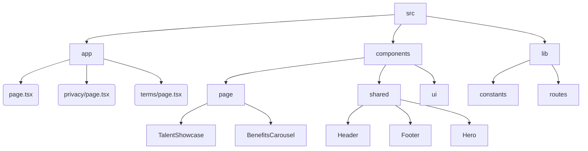

# Architecture Documentation

## Project Structure

## Route Map

| Route | Description | Component | Access |
|-------|-------------|-----------|--------|
| `/` | Landing Page (Main) | `src/app/page.tsx` | Public |
| `/terms` | Terms of Use & Disclaimer | `src/app/terms/page.tsx` | Public |
| `/privacy` | Privacy Policy & Data Info | `src/app/privacy/page.tsx` | Public |

## Key Components Hierarchy

- **Page Layout** (`layout.tsx`)
  - **Header** (`shared/header.tsx`)
  - **Main Content**
    - **Hero** (`shared/hero.tsx`)
    - **Benefits Carousel** (`page/benefits-carousel.tsx`)
    - **Talent Showcase** (`page/talent-showcase.tsx`)
      - Search Bar
      - Filters
      - Talent Grid
      - Portfolio Modal
  - **Footer** (`shared/footer.tsx`)

## Data Flow
- **Professional Data**: Mock data defined in `src/lib/constants.ts` -> Consumed by `TalentShowcase` and `Hero` (count).
- **Routing**: Constants defined in `src/lib/routes.ts` -> Consumed by navigation components (`Footer`, `Header`).
